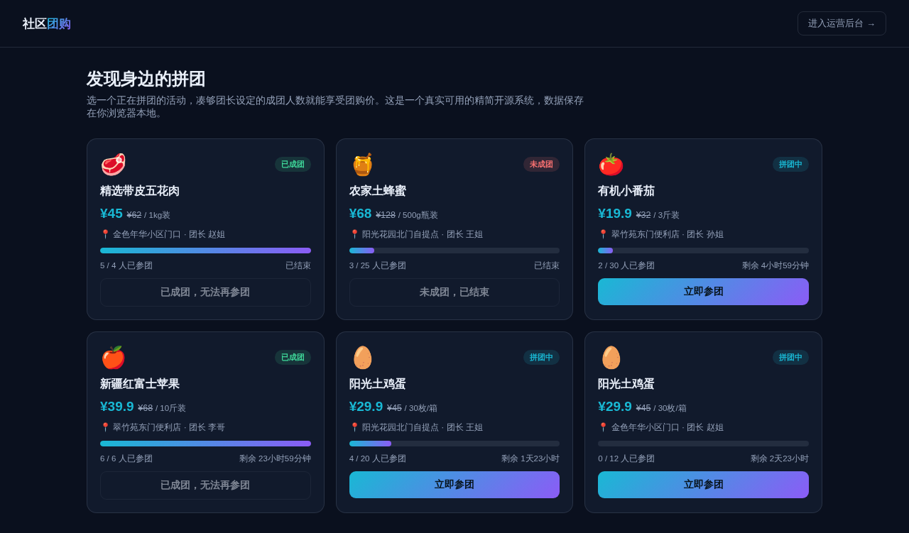

# 社区团购系统（精简开源版）· GroupBuy Lite

**[在线体验（前台）→](https://anna123123123-creator.github.io/groupbuy-lite/)** · **[运营后台 →](https://anna123123123-creator.github.io/groupbuy-lite/admin.html)**

免费开源的社区团购系统精简版。这不是截图或原型图，是一个**真实可用**的前后台系统：团购活动浏览、在线参团、真实的成团人数判定（凑够团长设定的目标人数或截止时间一过就会自动判定成团/未成团），后台商品与团购活动增删改查、参团人名单、真实的成交金额统计——都是真功能，纯前端 + `localStorage` 实现，不需要服务器、不需要数据库，克隆下来打开就能用，也适合作为学习或二次开发的起点。



## 功能

**前台（用户视角）**
- 拼团活动列表：团购价 / 原价对比、自提点、团长、参团进度条、剩余时间、状态徽章（拼团中 / 已成团 / 未成团）
- 仅"拼团中"的活动才能在线提交参团申请（姓名、手机号、数量），提交前会重新校验活动是否仍然有效——即使表单在浏览器里放了一段时间、活动截止时间已过或已被后台修改，也会被拒绝并给出明确提示，不会把过期参团写进数据
- 参团成功后进度条实时更新，凑够目标人数会立刻自动变成"已成团"，不需要任何人工操作

**后台（运营视角）**
- 仪表盘：团购活动总数、拼团中活动数、已成团活动数、已成交总金额（仅统计**已成团**活动的参团金额，拼团中/未成团的活动不计入）
- 商品管理：新增、编辑、删除拼团商品（团购价、原价、规格、封面）
- 团购活动管理：新增、编辑、删除团购活动（选择商品、自提点、团长、目标人数、截止时间），并可查看每个活动的参团人名单

## 试用方法

克隆下来，直接用浏览器打开 `index.html`，或用静态文件服务器跑起来：

```bash
python3 -m http.server 8000
```

前台在 `index.html`，后台在 `admin.html`。所有数据存在浏览器的 `localStorage` 里（`groupbuy_lite_data_v1` 这个 key），后台侧边栏有"重置示例数据"按钮可以随时清空重来。

## 技术说明

没有用任何框架或构建工具，纯原生 HTML/CSS/JavaScript，一共 4 个文件：`data.js`（数据层，负责 localStorage 读写、种子数据、成团状态与成交金额的计算逻辑）、`index.html` + `script.js`（前台）、`admin.html` + `admin.js`（后台）。

因为是纯前端 Demo，数据只存在当前浏览器里，不同设备/浏览器之间不会同步，也没有真实的支付和短信通知。真实生产系统需要一个后端 API + 数据库来替换 `data.js` 里的存储层，并接入真实支付、短信/微信通知、自提核销等能力，界面和交互逻辑基本可以直接复用。

## 协议

MIT，随便怎么用都行。

## 相关项目

这是完整版**社区团购平台系统**的精简开源示例——完整版支持团长佣金自动结算、多级分销与邀请返利、真实支付与自提核销扫码、库存与供应链对接，源码在这：[社区团购源码](https://inzyxuashop.com/shequtuangou-yuanma.html)。
